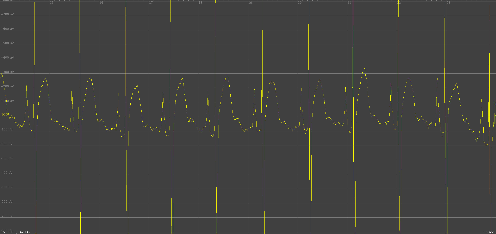
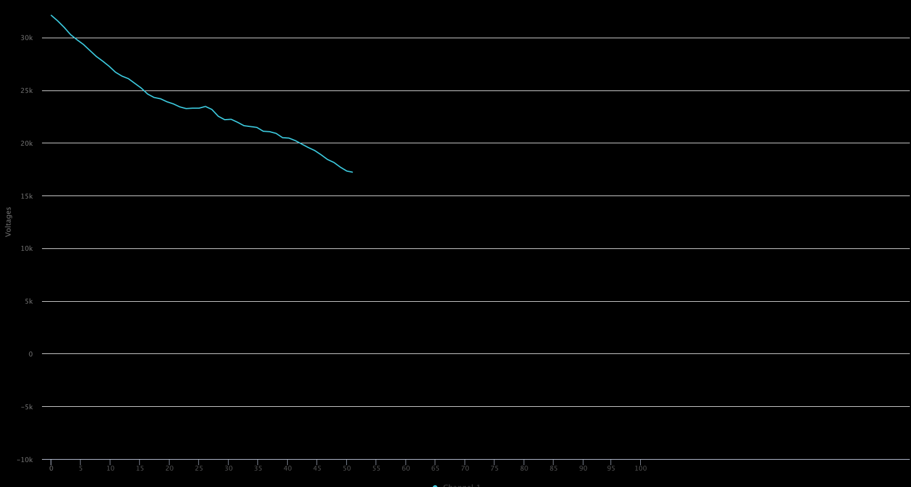
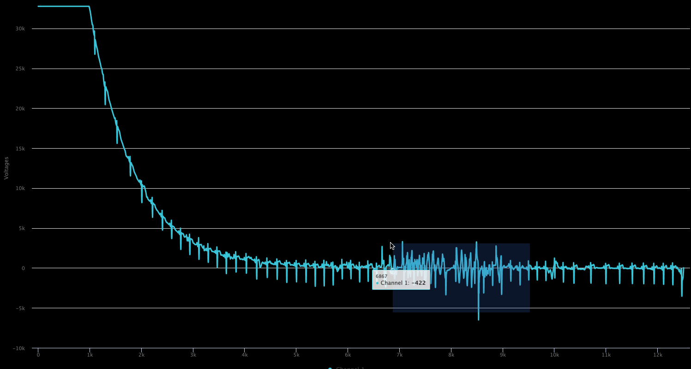

# Idoven.ai React Coding Challenge


This code challenge tests your skills in react.js (using Typescript, Javascript), testing and modular design. The purpose of the application is to correctly displaying in a graphical interface and Electrocardiogram (ECG). Yo can find the example file you need to work with in the data directory.

We are looking for the challenge participant to read the file in data, that represent a long ECG recording, and show in a human scale way in the screen of the device.

The user has to be able to navigate across the file, going backware and fordware, do zoom, and select and area to zoom to.

And example image of the expected results is like this



We recomend to:

- Use material ui components and styled-component styles

- Write meaninful and useful unit tests. You can use jest.

- Use functional components

- Improve code structure. Your implementation should be more like how you do it for any production grade application development

- Define Typescript where necessary

- Use React context API and hooks to showcase your understanding of these React features

- Pay attention to performance of your page rendering

- "Idoven.ai Coding Challenge" is part of the design. Make sure that you dont miss that header

Applicants are provided this challenge with nan expextation of deadline. Please take the time you need to complete the challenge to the best of your ability within the allowed 7 days. Please submit your code either via Github or Gitlab

## My Solution

The main problem of the exercise is basically consuming in the frontend the file that contains all the time/voltage coordinate data that we want to render for each of the five channels.

The file is compressed in a `7z` file since when decompressing it occupies at least `1.6 Gb` of information on disk, having a txt extension. The file is in comma separated values format, containing voltage values per time for five different channels.

Obviously if we try to fetch the entire file the process will crash our computer, making it impossible to process and render the data.

This means that we need to think of other approaches to consume the data from this file on disk.

- Create a server that serves us the content of the file through streams using websocket. This would make data consumption progressive and constant, always in an amount that our app could render efficiently.

- Parsing the file with a script cleaning up its format, since many channels do not have voltage information for many time coordinates, which could significantly reduce the size of the file. After cleaning these rows, with another script we could separate the data into several files, one for each channel, which would reduce the size of the file on disk into several files that could be consumed if the client wants to view the data from that channel and not default.

- Directly consume the data.txt file from a fetch that returns a stream that we can read in a more efficient and procedural way.

In my opinion, the appropriate solution would be the first, since all this type of data processing has better performance if it is done on the server side, since, for example, we can have more efficient languages when it comes to processing a large amount of data and structures like python, besides, **the tools and apis that we have on the server to manage streams are much more powerful and versatile than the ones we have on the frontend**.

for example for `node.js`

```js
function streamFile() {
  let lines = 0;

  const readableStream = createReadStream('./example2.txt', 'utf8');

  readableStream.on('error', function (error) {
    console.log(`error: ${error.message}`);
  });

  const reader = readline.createInterface({
    input: readableStream,
  });

  reader.on('line', (line) => {
    // read here line by line
  });
}
```

After consulting about what the approach should be to complete the technical test, I understood that it was looking for me to follow the last approach described here, _Directly consume the data.txt file from the client app_.

To do this, create a `usePullBeatsByChannelService` hook that could consume the file via a configurable initial load and a scheduled load at a constant time interval until the file read is complete.

To do this, create a `usePullBeatsByChannelService` hook that could consume the file via a configurable initial load and a scheduled load at a constant time interval until the file read is complete.

For this, we are going to use the Readable [Stream API](https://developer.mozilla.org/en-US/docs/Web/API/ReadableStream) when the fetch of the file returns a readableStream in its body over which we can iterate chunk of information by chunk.

```ts
const getFileStream = useCallback(async (): Promise<
  ReadableStream | null | undefined
> => {
  let response;

  try {
    response = await fetch(filePath);
  } catch (error) {
    throw new Error(`An error appears fetching the file to parse: ${error}`);
  }

  return response?.body;
}, [filePath]);
```

So with this hook, we can load an initial amount of data to pool the remaining data from time to time, freeing our application's load, being able to render in a much more progressive way.

```ts
const { beats, loading } = usePullBeatsByChannelService(
  'example3.csv', // file path
  0, // start time to pull values
  50, // end time to pull values
  {
    time: 1, // interval of time to pull rest data
    range: 261, // time range to pull values in each interval
  }
);
```

Yes, I use a `example3.csv` file with less data than the original `data.txt` take in to account that git can't upload large files.

I understand that the proposal should be better designed and probably look for even better performance, it is simply an example and proposal of how I would start to think about the problem.




## Install the project

Run `npm i` to install dependencies.

## Run the project

Run `npm start` and go to `http://localhost:4200/` in your localhost.
